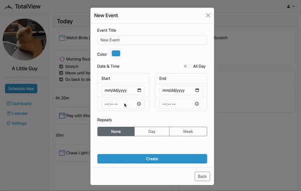
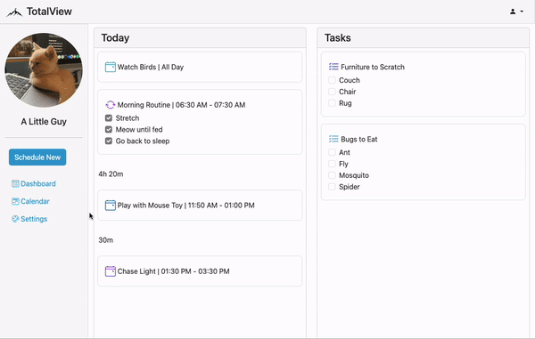

# TotalView

TotalView is productivity app that allows a user to create traditional calendar events, routines for forming habits, and task lists to organize to-dos.

## Features

- Create one-time or recurring calendar events
- Create repeating routines with a list of actions to complete
- Create one-time or recurring task lists with a list of tasks to complete
- View daily, weekly, and monthly schedule
- View gaps of time between scheduled items
- Edit and view details for scheduled items
- Toggle between light and dark mode
- Set custom colors for scheduled items, main buttons, and nav links

## Demo

See the demo video for TotalView [here](https://www.youtube.com/watch?v=cfkpgqYO2BU)

#### Creating a new event

#### Viewing events on calendar

## Tech Stack

| Category | Tech |
| ------ | ------ |
| Backend | Python, Flask, Pandas, PostgreSQL, SQLAlchemy |
| Frontend | JavaScript, HTML, CSS, Bootstrap |
| API | FullCalendar |
| Other | Jinja |

## Author

Melissa McGrath | [GitHub](https://github.com/melissam640) | [Linkedin](www.linkedin.com/in/melissa-mcgrath)